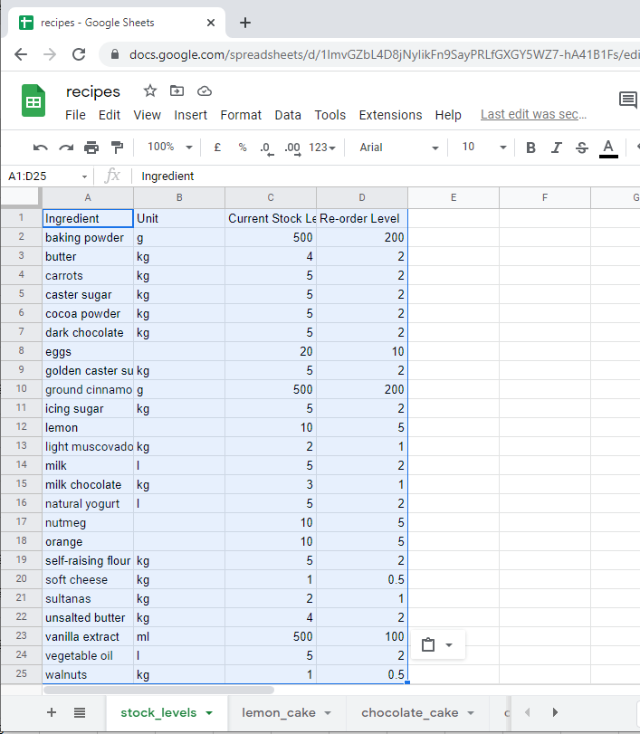

<h1 >Shopping List Compiler</h1>

This is a Python command line application which runs in the Code Institute mock terminal on Heroku.

It is designed for use by a baking establishment but could be used by any business whose products are built from recipes or 
lists of ingredients/parts.

It compiles a list of ingredients and quantities required to fill the days orders. 

It holds the current stock and re-order levels for each ingredient and only includes ingredients in the shopping list that do not have
sufficient quantities in stock.

&nbsp;  

# How to use

The recipes or lists of ingredients are held on [Google Sheets]( https://en.wikipedia.org/wiki/Google_Sheets).  

This workbook also includes a sheet for the stock and re-order levels for each ingredient.

The user is prompted to enter the days orders.

The complete list of required ingredients for all the orders are calculated.

The Shopping List is then displayed on the screen.

E.g. There are recipes provided for 3 different cakes
1. Lemon cake
2. Chocolate cake
3. Carrot cake

If the days orders are for 2 lemon, 3 chocolate and 1 carrot then the application will print out the complete list of ingredients and amounts required to make them.
e.g.
1. Flour - 2 Kg
2. Butter - 2 lb
etc

&nbsp; 

# Features

## Existing Features

- The application uses [Google Sheets]( https://en.wikipedia.org/wiki/Google_Sheets) to hold the data required.  
There is a single spreadsheet called recipes and each recipe has a sheet for its ingredients list where it holds the ingredient name and the quantity required.  

- There is also a sheet for the stock and re-order levels for each ingredient.

- To access the spreadsheet the application uses 2 API's (Application Programming Interface).  
These are set up on the [Google Cloud Platform] (https://console.cloud.google.com/).
    - The first is Google Drive where it gets its credentials. These are stored in a json file called creds.json
    - The second is Google Sheets

- Input validation and error-checking
    - You can only enter positive integers values below 1000.
    - You can only enter recipe numbers that exist in the displayed list.
    - Answers to Y/N questions are validated.
    - An error is displayed if the sheet can not be retrieved from Google Sheets  

- Data maintained in class instances  

- Responsive on all device sizes  

## Future Features

- Allow the addition, update, deletion and viewing of recipes
- Allow the addition, update, deletion and viewing of orders for a particular date
- Allow the addition, update, deletion and viewing of order levels for each ingredient

# Flowcharts
You can see the flowcharts for this project here:-  

[Main](docs/images/main.png)  
[Build Recipe List](docs/images/build_recipe_list.png)  
[Display Recipe List.png](docs/images/display_recipe_list.png)  
[Get Order.png](docs/images/get_order.png)  
[Compile Shopping List](docs/images/compile_shopping_list_v2.png)  
[Display Orders](docs/images/display_orders.png)  
[Display Shopping List.png](docs/images/display_shopping_list.png)  

# Data Model

# Testing

# Bugs

## Solved Bugs

## Remaining Bugs

# Validator Testing

# Deployment

This project was deployed  using Code Institute's mock terminal for Heroku.

- Stes for deployment:
    - Fork or clone this repository 
    - Create a new Heroku app
    - Set up the buildbacks to <code>Python</code> and <code>NodeJS</code> in that order
    - Link the Heroku app to the repository
    - Click on <code>Deploy</code>

# Credits

* Code Institute for the deployment terminal
* [Simen Daehlin](https://github.com/Eventyret "Simen Daehlin") for code inspiration, help and advice.

