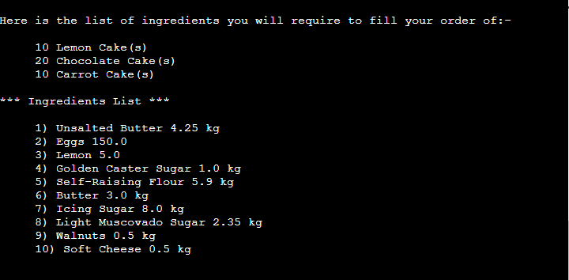

<h1 >Shopping List Compiler</h1>

This is a Python command line application which runs in the Code Institute mock terminal on Heroku.

It is designed for use by a baking establishment but could be used by any business whose products are built from recipes or 
lists of ingredients/parts.

It compiles a list of ingredients and quantities required to fill the days orders. 

It holds the current stock and re-order levels for each ingredient and only includes ingredients in the shopping list that do not have
sufficient quantities in stock.

It also converts grams to Kg and ml to litres for ordering.

&nbsp;  

# How to use

The lists of ingredients required for each recipe are held on [Google Sheets]( https://en.wikipedia.org/wiki/Google_Sheets).  

This workbook would be available to and maintained by the user.

This workbook also includes a sheet for the stock and re-order levels for each ingredient.

The user is prompted to enter the days orders. This could be the orders for the coming week.

The application goes through all the orders calculating how much of each ingredient is required and comparing this to the current stock levels to ensure that   
1) An ingredient is only listed if the required amount is not in stock 
2) The required amount of the ingredient listed is the amount required less what is available in stock and above the reorder level.

The Shopping List is then displayed on the screen, written to a text file and also written out to a tab on the spreadsheet.

&nbsp; 

# Features

## Existing Features

- The application uses [Google Sheets]( https://en.wikipedia.org/wiki/Google_Sheets) to hold the data required.  
There is a single spreadsheet called recipes and each recipe has a sheet for its ingredients list where it holds the ingredient name, the quantity required and the unit.  

- There is also a sheet for the stock and re-order levels for each ingredient. This has a unit value which can differ from the recipe unit.

- To access the spreadsheet the application uses 2 API's (Application Programming Interface).  
These are set up on the [Google Cloud Platform] (https://console.cloud.google.com/).
    - The first is Google Drive where it gets its credentials. These are stored in a json file called creds.json
    - The second is Google Sheets

- Input validation and error-checking
    - The quantity of each order must be between 1 and 10,000.
    - You can only enter recipe numbers that exist in the displayed list.
    - Answers to Y/N questions are validated.
    - An error is displayed if the spreadsheet can not be retrieved from Google Sheets  

- Data maintained in class instances  

- Reads all recipes stored on the spreadsheet and displays then on the screen. It displays a formated version of the tab name and a number. 

- Requests a recipe number to order. This is validated and continually requested until a valid entry is made. 

- Requests a quantity to order. This is validated and continually requested until a valid entry is made. 

- Displays the order entered and requests if another order is to be entered until the answer is 'n' or 'N'.

- Calculates the required amount of each ingredient listed for all the recipes in the order. Amounts are only listed if required anount > current amount in stock - reorder level.

- Displays the list of required items on the screen, in a text file and in a tab on the spreadsheet called 'shopping-list'.

- Responsive on all device sizes  

## Future Features

- Allow orders to be entered on the spreadsheet and loaded into the application for processing.
- Allow the maintenance and viewing of the spreadsheet contents from the application.

# Flowcharts
You can see the flowcharts for this project here:-  

[Main](docs/flowcharts/main.png)  
[Build Recipe List](docs/flowcharts/build-recipe-list.png)  
[Display Recipe List.png](docs/flowcharts/display-recipe-list.png)  
[Get Order.png](docs/flowcharts/get-order.png)  
[Compile Shopping List](docs/flowcharts/compile-shopping-list-v2.png)  
[Display Orders](docs/flowcharts/display-orders.png)  
[Display Shopping List.png](docs/flowcharts/display-shopping-list.png)  

# Data Model
The application has a class based model.
The classes defined are 
1) Recipe
-   Properties 
    -   Name                          String
    -   List of ingredient objects    Number
-   Methods  
    -   --init--            - Takes the recipe name and a list of ingredients and creates an ingredient object for each one
    -   format_recipe_name  - Takes tab name and removes the underscore and capatalises for display

2) Ingredient
-   Properties 
    -   Name        String
    -   Quantity    Number  
    -   Unit        String
-   Methods  
    -   --init--           
    -   increase_quantity  - Takes the quantity to add to the instance quantity value for and adds it.

3) Stock level - this is a sub class of Ingredient and inherits from it
-   Properties 
    -   Name            String  Inherited
    -   Quantity        Number  Inherited, used as the current quantity level for the ingredient
    -   Unit            String  Inherited
    -   Reorder Level   Number
-   Methods  
    -   --init--           
    -   decrease_current_level  - Decreases the quantity of the instance
    -   convert_current_level   - Converts quantity to grams or ml if appropriate
    -   convert_reorder_level   - Converts reorder level to grams or ml if appropriate

Other data structures used are 
    - Orders - dictionary {recipe, quantity}
    - Shopping List - List of ingredient objects
    - Recipes - List of recipe objects
    - Ingredients - List of stock level objects

# Testing
I performed the following test to ensure the application functions correctly.
1) Add order of 10 Lemon Cakes, 20 Chocolate Cakes and 10 Carrot Cakes
-   Here is the output  

-   Here are some screenshots of the spreadsheet I used to confirm that the calculated values were correct.
-   
-   
-   As you can see the results match up e.g. 150 eggs
-   Here is the spreadsheet itself which needs to be opened in excel.
[Test Case Calculations](docs/testing/test-case.xlsx)

I performed many other tests also
-   [Various tests](docs/testing/testing-various.png)

I renamed the spreadsheet to prevent it being read and successfully got the message that it was unavailable and to try later.
-   [Failure to read file](docs/testing/cant-read-file.png)  

I tried requesting the application restart which it did.  

I tried entering multiple orders for the same recipe. It added the quantities together correctly.

# Bugs

## Solved Bugs
-   I forgot to set the restart value to 'n' in the event that the workbook could not be retrieved.  
    This resulted in an infinite loop as the application kept trying to run.
    To resolve I set it in the except part of the try exception statement.

## Remaining Bugs

-   There are no remianing bugs that I am aware of.

# Validator Testing

- PEP8
    - No errors were found from http://pep8online.com/
    

# Deployment

## Local deployment
### Code deployment
- Steps for deployment:
    - Go to https://github.com/evelynfoy/shopping-list-compiler and click on the Code button.
    - There are several ways to get this application working locally
        - Using GITPOD 
            - Add Gitpod extension to Chrome (or firefox) - chrome://extensions/ 
            - search for gitpod and click add
            - Go to https://github.com/evelynfoy/shopping-list-compiler 
            - Click the green Gitpod button on the right of the screen.
            - This will create a new local workspace for you to work in.
        - Clone the repository from the https url on GitHub 
            - Go to https://github.com/evelynfoy/shopping-list-compiler 
            - Click on the Code dropdown button on the right hand side of screen
            - Click the copy button to the right of the HTTPS url to get the url to use
            - Open Git Bash on you local machine and type git clone and the url e.g.
              git clone https://github.com/evelynfoy/shopping-list-compiler.git
            - This will create a repository on your machine.
            - To run you need to install python3 and node.js
        - Download the code as a ZIP file, unpack and open with your favorite editor e.g. vscode 
        
### Spreadsheet Deployment
The idea of this application is that each client would have their own version of the spreadsheet which they can view and maintain with their own data.
For this to happen the client would need to be set up with a Google Sheets spreadsheet under their own Google Account.
Here are the instructions required for this.
-   Set up a Google Sheet called Recipes - https://docs.google.com/spreadsheets/u/0/
    You will need a Google Account - https://accounts.google.com/signup/v2/webcreateaccount?flowName=GlifWebSignIn&flowEntry=SignUp
-   To give the app access to it create a project on the Google Cloud platform https://console.cloud.google.com/ called shopping-list-compiler
    Enable two APIs, Google Drive and Google Sheets - APIs and services -> Library, search for each API, click to select and click enable.

-   Create credentials by clicking on the Credentials tab and then on Create Credentials button  
    Enter Google Drive API for 'Which API are you using', Application Data for what data will you be accessing and   
    No, I'n not using them for 'Are you planning to use this with App Engine or Compute Engine'?  
    Click Next    
    Enter a Service Account name of shoppinglistcompiler then click Create  
    In the Role Dropdown box choose Basic > Editor then press Continue  
    The Grant users access to this service account can be left blank.  
    Click Done  
    On the next page, click on the Service Account that has been created  
    On the next page, click on the Keys tab  
    Click on the Add Key dropdown and select Create New Key  
    Select JSON and then click Create. This will trigger the json file with your API credentials in it to download to your machine.   
    This will likely download to your downloads folder on your machine.  

    There is no need for more credentials for the Google Sheets API so you can just enable it.  

-   Copy the credentials file downloaded into the root directory of the source code and rename it creds.json. Open it and copy the client_email value.   
    Then go back to the Google Sheet, click on the green Share button and paste in the value.   
    Make sure “Editor” is selected, untick “Notify People”, and then click "share".  
    This will give your version of the code access to your copy of the spreadsheet.  
    Note that the credentials file contains sensitive information that should be kept secret.  

## Remote deployment

This project was deployed using Code Institute's mock terminal for Heroku.

- Steps for deployment:
    - Fork or clone this repository 
    - Create a new Heroku app - https://dashboard.heroku.com/apps. You will need an account for this.  
    - On the Settings tab
        - Copy the credentials from the creds.json file into the Config Vars setting, KEY = CREDS
        - Add another setting of PORT 8000
        - Add buildbacks for both <code>Python</code> and <code>NodeJS</code> in that order.
    - On the Deploy tab
        - Link the Heroku app to the Github repository in Deployment method
    - Click on the <code>Deploy Branch</code> button
    - This will supply you with an url to run the application i.e. https://shopping-list-compiler.herokuapp.com/

## To run the application

-   The application has been deployed to https://shopping-list-compiler.herokuapp.com/.  
    It can be accessed there or through the github repository - https://github.com/evelynfoy/shopping-list-compiler

# Credits

* Code Institute for the deployment terminal and help and inspiration for the love-sandwiches run through project.
* [Simen Daehlin](https://github.com/Eventyret "Simen Daehlin") for code inspiration, help and advice.

